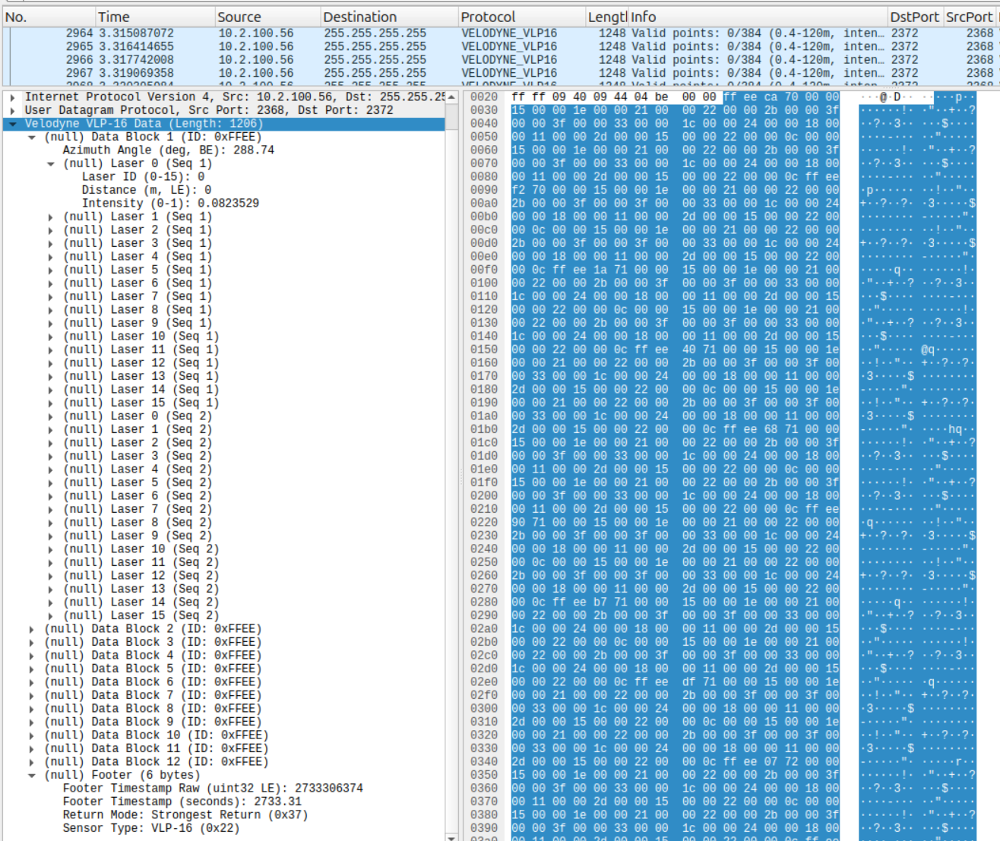

# Summit Embedded Velodyne Helper Files

This repo was created mainly to share Summit's velodyne_vlp16.lua Wireshark plugin. This file is useful for debugging low-level communication issues in real-time using Wireshark. ROS & RViz have many configurations, so debugging connection issues in RViz can make it hard to narrow down wether a problem lies with the device/wiring configuration, or with the PC software configuration. This Wireshark plugin helps to clearly determine whether the raw data coming in on the ethernet interface is valid or not.

## Wireshark Plugin
The 'velodyne_vlp16.lua` file can be imported into Wireshark.

To install it in Linux, make a symlink as follows:

``` bash
# On Linux:
mkdir -p ~/.local/lib/wireshark/plugins/;
ln -s $(pwd)/velodyne_vlp16.lua ~/.local/lib/wireshark/plugins/velodyne_vlp16.lua
```

To install it in Windows, copy the `velodyne_vlp16.lua` file to `C:\Program Files\Wireshark\plugins\`

Then restart Wireshark.

The plugin applies itself to any packet sent to the port range 2368-2372. 2368 is the default port for VLP16 devices, but that port is often offset if multiple devices are on the same ethernet subnet.

If configured correctly, it will dissect packets like this:


## Other files
The `velodyne-vlp16-1.pcapng` file is a sample of data that can be used to test the .lua plugin.

The `supporting_files/vlp16.yaml` file was used to read the same lidar data in ROS's rvis2 tool.

The python-script branch is a work-in-progress branch to allow analysis of a pcap file in python. Currently, it can read pcap files but the payload byte offsets need debugging, so it's excluded from the main branch for now.